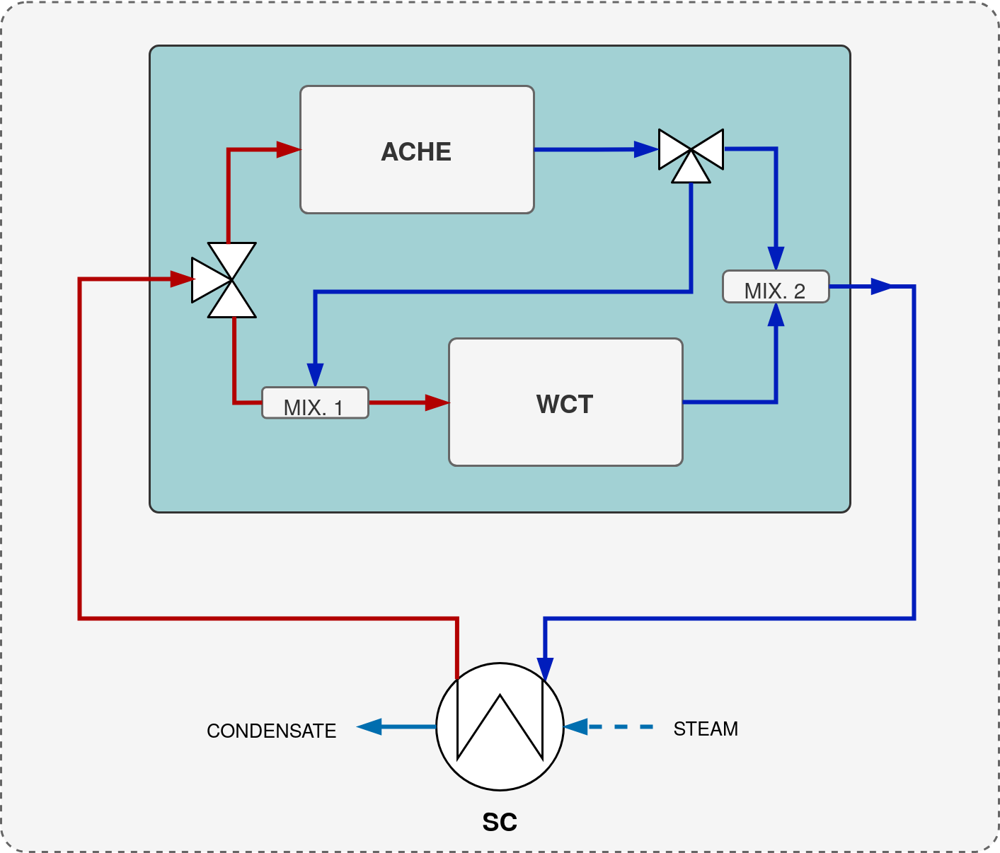
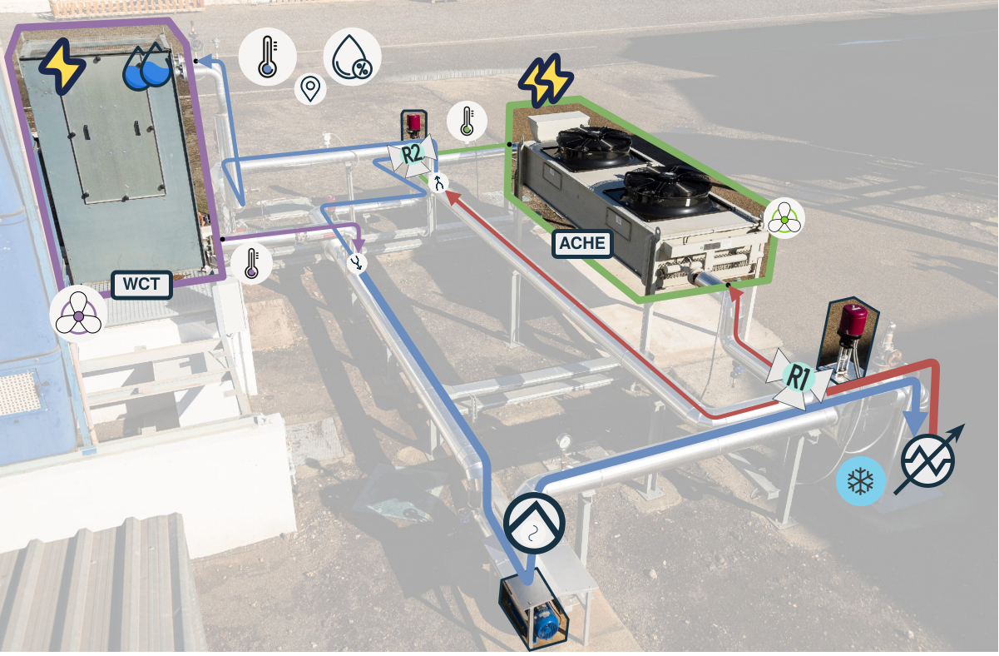

# SOLhycool

Combined cooling solutions...




## Getting started

### Development environment

The repository contains a [Dockerfile](../Dockerfile.base) and a [devcontainer configuration](../.devcontainer/devcontainer.json) to set up a development environment with all the necessary dependencies. 

#### Starting the devcontainer

Open (clone) the repository with VSCode and `CTRL+SHIFT+P` to open the command palette and select `devcontainers: Reopen in Container`.

#### Setting up the development environment from within the container

Once inside the container, set up a new conda environment with the necessary dependencies:

```bash
conda init zsh
```

Create and install dependencies using the `environment.yml` file:

```bash
conda env create -f environment.yml
```

Activate the environment:

```bash
conda activate conda-env
```

## Project structure

```bash
.
├── README.md
├── modeling
├── optimization
└── simulation
```
The project is divided into three main folders: `modeling`, `optimization`, and `simulation`. Each folder contains the respective code and data for each part of the project.


# Copyright and License

```text
Copyright 2025 Juan Miguel Serrano

Licensed under the Apache License, Version 2.0 (the "License");
you may not use this file except in compliance with the License.
You may obtain a copy of the License at

    http://www.apache.org/licenses/LICENSE-2.0

Unless required by applicable law or agreed to in writing, software
distributed under the License is distributed on an "AS IS" BASIS,
WITHOUT WARRANTIES OR CONDITIONS OF ANY KIND, either express or implied.
See the License for the specific language governing permissions and
limitations under the License.
```