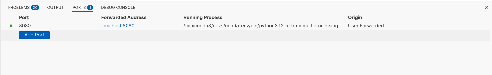

# Project deployment with airflow

In order to streamling the evaluation of the optimization and annual simulations, 
instead of relying on running the scripts manually 
(see [optimization/README.md](../optimization/README.md)), a better approach is
to setup workflows with [Apache Airflow](https://airflow.apache.org/).

This repository uses a custom Dockerfile, which using the base Dockerfile that is 
used for development, extends it to add Airflow to the conda environment.

## Getting started

### Developement environment

Within the devcontainer, just run the following command to start up Airflow:

```bash
airflow standalone
```

If it fails, it an issue with some configuration parameter missing in some airflow version!

Add:
`socket_cleanup_timeout = 30`

Under `[workers]` section in the airflow.cfg. See [pull 52705](https://github.com/apache/airflow/pull/52705)

In order for it to persist even when exiting the devcontainer, run the following command on the host:
```bash
docker exec -d CONTAINER_NAME bash -c "source /miniconda3/bin/activate conda-env && airflow standalone"
```
Though the web interface will only be available if forwarding the 8080 port. This can be done in VSCode in the ports settings.


### Production deployment

(Proably calling it production is a bit far fetched)

1. Initialize the database
```bash
docker compose up airflow-init
```

2. Start up all services
```bash
docker compose up -d
```

# To start from schratch
[Source](https://airflow.apache.org/docs/apache-airflow/stable/tutorial/pipeline.html)

In a while, maybe the docker-compose.yaml file will be updated, to get the latest version, you can run the following commands:

```bash
### Download the docker-compose.yaml file
curl -LfO 'https://airflow.apache.org/docs/apache-airflow/stable/docker-compose.yaml'

### Make expected directories and set an expected environment variable
mkdir -p ./dags ./logs ./plugins
echo -e "AIRFLOW_UID=$(id -u)" > .env

### Initialize the database
docker compose up airflow-init

### Start up all services
docker compose up
```