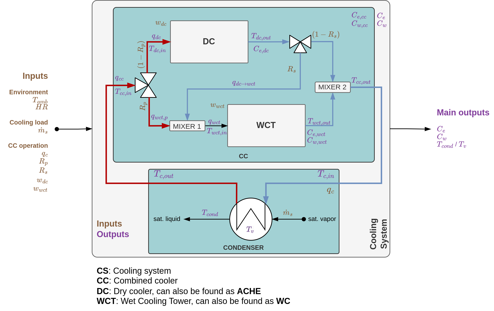
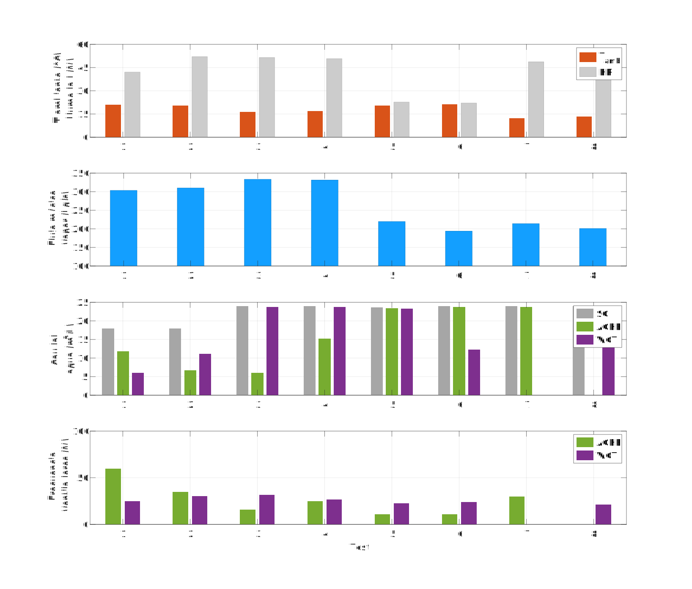
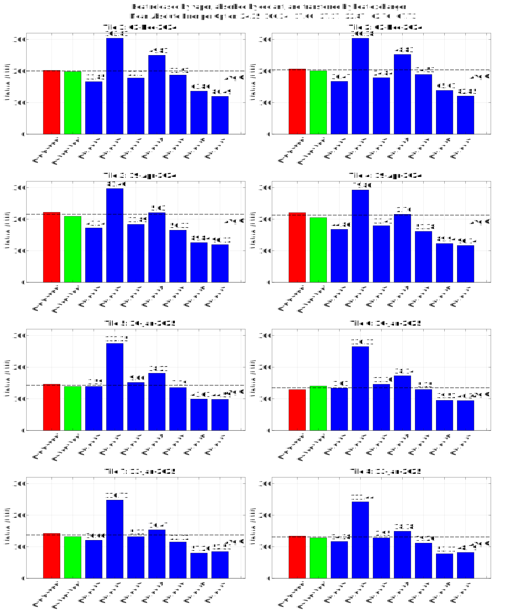
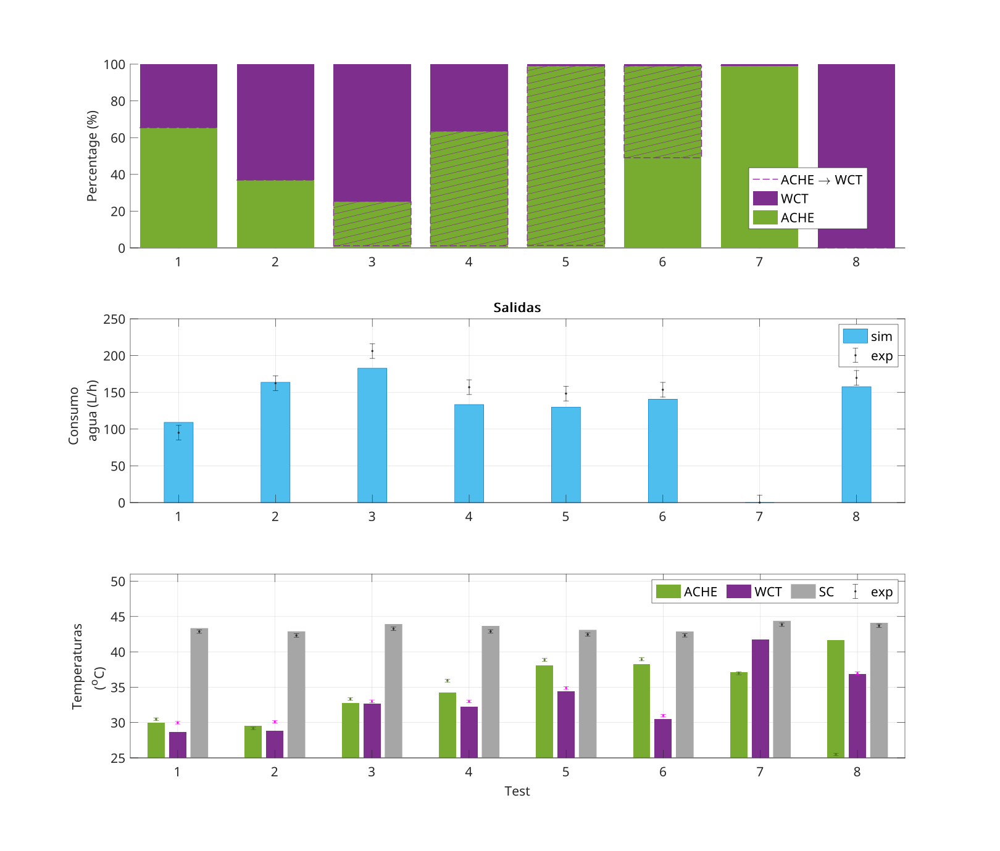
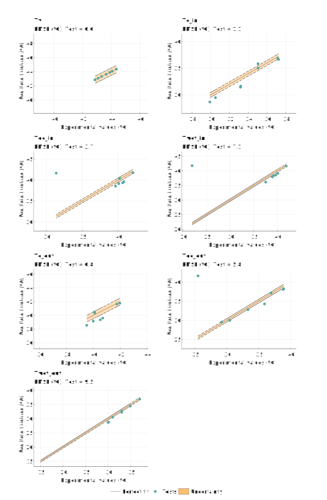
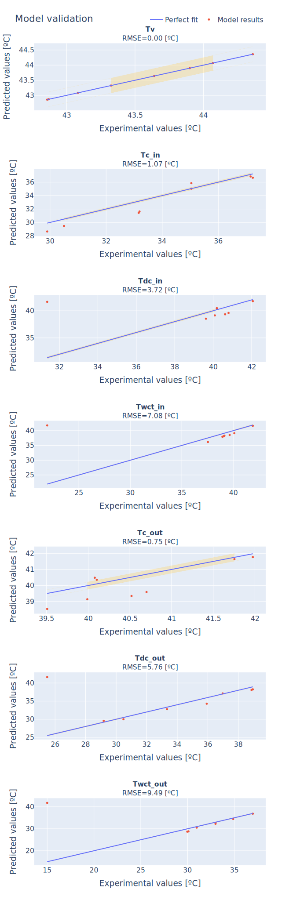
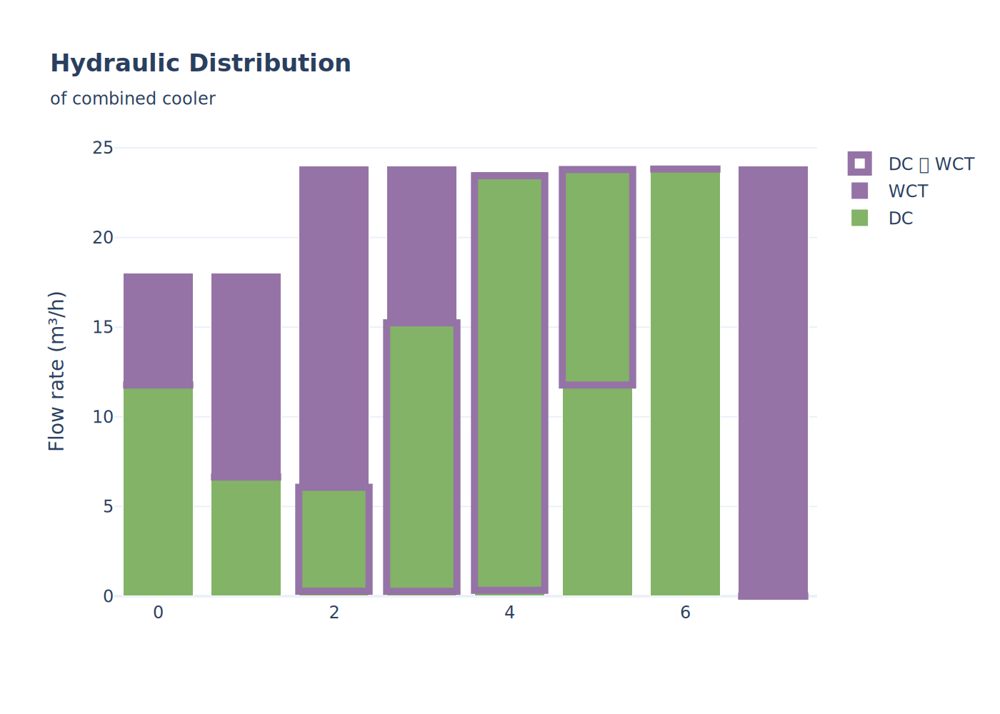
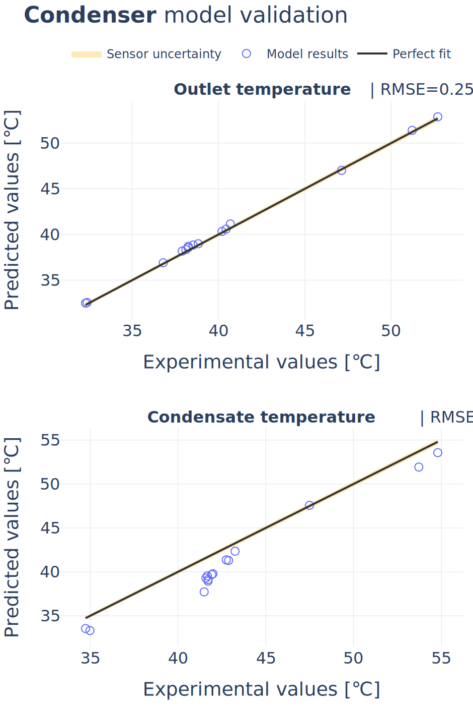

# Combined cooling system model

## Pasos a seguir
- [x] Estructura de salida para `detailed_outputs`
- [x] En lugar de "hardcode" datos de validación, generar un CSV con los mismos nombres de variable que nomenclatura y guardar en carpeta de paquete assets
- [x] Script para test de modelos individuales y definir entradas/salidas y datos de validación
- [x] Analizar código de Lidia
	- Refactorizar para hacer más leible
	- Quitar funciones no necesarias (visualización, datos, etc)
- [x] Mirar cómo "importar módulos" en MATLAB para poder seleccionar hacer uso de modelos físicos o modelos basados en datos
- [x] Integrar todo
- [x] Generar estructura que incluya todas las variables de proceso y sea lo que devuelva la función al ser llamada como variable secundaria: `Tv, Ce, Cw, detailed_outputs = model(inputs)`
- [x] Buscar un diagrama de nomenclatura, y ahí incluir con colores todas las variables del sistema con colores para salidas y entradas
- [x] Exportar modelo a python
- [x] Mover código a un repositorio

## Description

This package contains the model of a cooling system. The system is composed by a condenser and a combined cooler. The condenser, which takes in saturated vapor from the outlet of a turbine (or any other process really), condenses it, and thus returns it as saturated liquid. In order to achieve this, a cooling fluid (water) which absorbs the heat, is circulated. The combined cooler is in charge of cooling down this cooling fluid. It does it by using two cooling technologies: a Dry Cooler (DC) and a Wet Cooler (Tower, WCT). They are connected in a circuit with two three-way valves which allows almost continuous variation in the hydraulic distribution of the cooling fluid in: series operation (DC -> WCT), parallel, or using only one of the systems (only DC, only WCT).

## Nomenclature

TODO: @Lidia revisar todas las unidades!!
TODO: Modificar $\dot{m}_s$ por $\dot{m}_v$

Description of all system variables. They are included in the model output `detailed_outputs` structure.

_Syntax: Variable name. Description (units)_

#### Inputs
##### Environment
- $T_{amb}$. Ambient temperature. Might also be found as $T_{\infty}$ ($^\circ$C)
- $HR$. Relative humidity (%)

##### Cooling load
- $\dot{m}_v$. Steam mass flow rate (kg/h)

##### Combined cooler operation
- $q_c$. Cooling flow rate (m³/h)
- $R_p$. Parallel distribution ratio (-)
- $R_s$. DC -> WCT series distribution ratio (-)
- $\omega_{dc}$. DC fan percentage (%)
- $\omega_{wct}$. WCT fan percentage (%)

#### Outputs
##### Main outputs
- $C_e$. Electrical consumption (kWe)
- $C_w$. Water consumption (l/h)
- $T_v$. Vapour temperature in the condenser (equivalent to condensate temperature $T_{cond}$) ($^\circ$C)

##### `detailed` structure
- all inputs
- main outputs

##### Condenser
- $Q_{c}$. Condenser thermal power (latent released by vapor == sensible absorbed by coolant == transferred by heat exchanger) (kWth)
- $T_{c,in}$. Condenser inlet temperature (ºC)
- $T_{c,out}$. Condenser outlet temperature (ºC)
- $T_{cond}$. Condensed vapor temperature (==Tv since we assumen it leaves as saturated liquid) (ºC)
- $C_{e,c}$. Cooling sytem recirculation pump electrical consumption (kWe).

##### Combined cooler
- $q_{cc}$. Volumetric flow rate (m³/h)
- $T_{cc,in}$. Inlet temperature (ºC)
- $T_{cc,out}$. Outlet temperature (ºC)
- $C_{e,cc}$. Electrical power consumption (kWe)
- $C_{w,cc}$. Water consumption (l/h)
- $q_{wct,p}$. Wet cooling tower parallel flow component (m³/h)
- $q_{wct,s}$ Wet cooling tower series flow component (equivalent to $q_{dc\rightarrow wct}$) (m³/h)

##### DC
- $q_{dc}$. Volumetric flow rate (m³/h)
- $T_{dc,in}$. Inlet temperature (ºC)
- $T_{dc,out}$. Outlet temperature (ºC)
- $C_{e,dc}$. Electrical power consumption (kWe)

##### WCT
- $q_{wct}$. Volumetric flow rate (m³/h)
- $T_{wct,in}$. Inlet temperature (ºC)
- $T_{wct,out}$. Outlet temperature (ºC)
- $C_{e,wct}$. Electrical power consumption (kWe)
- $C_{w,wct}$. Water consumption (l/h)

## Model validation

By running `test_model.m` the following results are generated:

NOTE: RMSE figures do not represent the actual accuracy (DC, WCT) since they also include points where the cooling component might not be operating.

### Python results

## Usage

1. Clone project
2. Open VSCode and reopen the project in devcontainer
3. If there is no `.venv` folder, create the environment by running `uv sync`
4. Open the notebook [test_model.ipynb](./notebooks/test_model.ipynb) and run it

## Package structure

- `scripts/`. Contains python scripts for testing and validation
- `notebooks/`. Contains Jupyter notebooks for testing and validation
- `src/`. Contains the python package source code
- `assets/`. Contains data and attachments
- `matlab`. Contains the MATLAB implementation of the model

### MATLAB

- `combined_cooler_model.m`. Model function.
- `test_model.m`. Script to test all package functions and validate model with some validation data.
- `default_parameters.m`. Returns a struct with default parameters that are used if otherwise not provided to the model. It can also be used as base to modify just some of them.
- `component_models/`. Individual component models
- `utils/`. Variety of utility code
- `exports/`. Folder where the model is exported to Python
